# Build a Supplier Performance Assistant Agent with Joule Studio and SAP S/4HANA Cloud

## Prerequisites

- Access to **Joule Studio**
- Access to an **SAP S/4HANA Cloud** system with:
  - Supplier evaluation scores retrievable via the Supplier Evaluation Scorecard OData API
  - Operational KPI trends retrievable via the Operational Score OData API
  - Purchase order history retrievable via the Purchase Order OData API
  - Approved supplier master data maintained for the relevant purchasing organisations
- Familiarity with the procure-to-pay process and supplier evaluation in SAP S/4HANA

## You will learn

- How to identify a procurement workflow that benefits from continuous, data-grounded supplier risk monitoring
- How to write an intent statement for an agent that detects at-risk suppliers and recommends alternatives
- How to review and validate the assets created, including the generated **Product Requirements Document (PRD)**
- How Joule Studio generates a solution using dedicated MCP servers for supplier scorecards, operational scores, and purchase order history
- How to deploy an agent that gives procurement managers early supplier risk alerts and ranked alternative recommendations inside Joule's conversational interface

## Intro

>**IMPORTANT**
>
>**Welcome to the Agent lab**
>
>You are working with a pre-release version of the Joule Studio. This gives you an early look at our upcoming capabilities. Please keep the following in mind:
>
> - **Features are subject to change:** The UI, terminology, and functionality you see may differ from the final product.
> - **Educational use only:** This environment is designed for learning and experimentation, not for production use.
> - **Potential instability:** As a preview version, you may encounter occasional instability or unexpected behavior.

Every procurement team lives with the same fear: a critical supplier starts to slip - delivery delays, quality issues, price drift - and nobody notices until a production line stalls. By the time the delay shows up in a status review, the window to re-source has already closed. The data to catch it earlier exists in SAP S/4HANA - supplier evaluation scorecards, operational scores, purchase order history - but it lives across different apps and no one has the time to continuously monitor it.

In this tutorial, you build a **Supplier Performance Assistant** using Joule Studio. The agent reasons over live supplier data in SAP S/4HANA Cloud - evaluation scorecards, operational scores, and purchase order history - detects suppliers trending toward risk, cross-references the approved supplier master data for alternatives, and delivers a plain-language advisory to the procurement manager at the moment the risk emerges, not months later. In practice, a procurement manager asks Joule something like *"which suppliers are currently trending toward risk?"* and the agent returns a ranked at-risk list with explanation and approved alternatives, right inside Joule's conversational interface.

You will move through all phases of the Joule Studio intent-based development process: from a plain-language intent statement to a deployed Python agent that calls SAP S/4HANA through auto-generated MCP servers.

> **About the scenario:** The supplier, scorecard, and purchase order values referenced in this tutorial are illustrative. The agent pattern applies to any organisation running structured supplier evaluation in SAP S/4HANA Cloud with approved supplier master data maintained.

> **Why supplier performance monitoring is a strong automation candidate?** The signal has a well-defined trigger (supplier KPI scores crossing configured thresholds), a bounded set of input data (evaluation scorecards, operational scores, purchase order history), a structured output (at-risk flag + alternative supplier recommendation + rationale), and a clear success criterion (fewer supply chain disruptions). Those characteristics make it an ideal target for a monitoring agent that augments the procurement manager's judgement rather than replacing it.

---

### Understand the Business Challenge

Before building the agent, it is important to understand the typical signals the agent must handle and the manual pain points it eliminates.

**Three typical at-risk signals**

A supplier shows "trending toward risk" through three distinct signal types. The agent monitors all three in parallel because any one of them can disrupt supply, but each is detected from a different data source.

| Signal | What it looks like | Where the agent sees it |
|--------|-------------------|-------------------------|
| **Delivery issues** | On-time delivery rate declining, lead times extending, missed promise dates | **Operational Score** API - delivery KPI trends over the last N scoring periods |
| **Quality issues** | Rejection rate rising, inspection failures recurring, non-conformance reports | **Operational Score** API - quality KPI trends, cross-referenced with purchase order history for root cause |
| **Price / contract drift** | Price variance against contracted terms, unfavourable new quotes, payment-term changes | **Supplier Evaluation Scorecard** + **Purchase Order** APIs - compared across orders to surface drift |

**Current pain points**

The manual approach to supplier risk monitoring creates well-understood operational challenges:

- **Review is periodic, risk is continuous** - Procurement reviews supplier scorecards monthly or quarterly, but KPI deterioration can emerge in a week. By the time a quarterly review flags a supplier, the disruption is often already underway.
- **Data lives across multiple SAP apps** - Supplier Evaluation Scorecard, Operational Score, and Purchase Order history are each in their own SAP Fiori app. Correlating the three signals requires manual cross-navigation.
- **Alternative suppliers are rarely surfaced proactively** - When a supplier is flagged, finding approved alternatives in the same category means searching the supplier master data manually, often under time pressure.
- **No audit trail for the detection decision** - A supplier is flagged (or not flagged) based on the reviewer's judgement at that moment. There is no systematic record of what signals triggered the concern.
- **Reactive communication to the sourcing team** - The sourcing team hears about at-risk suppliers through meetings and emails, not through a continuously maintained advisory feed.

> The agent you build in this tutorial retrieves supplier evaluation scorecards, operational KPI scores, and purchase order history from SAP S/4HANA Cloud, continuously detects suppliers trending toward risk, surfaces ranked approved alternatives, and delivers a plain-language advisory to the procurement manager inside Joule's conversational interface.

### Open Joule Studio and Define the Agent Intent

The **Intent** phase is the starting point of every agent in Joule Studio. You describe what you want the agent to do in plain business language. No technical specification required at this stage.

1. Open **Joule Work** - the SAP portal that hosts Joule Studio and other developer-facing capabilities - and navigate to **Joule Studio**. The **Create a new solution** page opens with four solution types.

    

2. On the **Agent** tile, choose **Create** to open the **Create Agent** dialog.

3. Complete the three fields in the dialog:

    - **Solution**: Leave **New Solution** selected to create this agent as a standalone solution.
    - **Name**: Enter the following agent name:
        ```
        Supplier Performance Assistant
        ```
    - **Intent Statement**: Enter the following statement in plain business language:
        ```
        Create an AI agent that monitors supplier performance, identifies at-risk suppliers,
        and recommends approved alternative suppliers using procurement data from SAP system.
        ```

    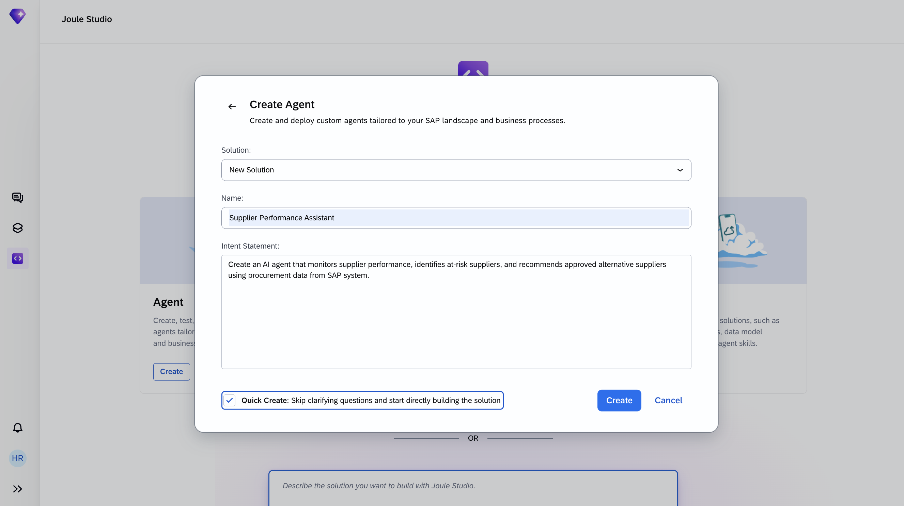

4. At the bottom of the dialog, verify that **Quick Create** is active (it is on by default). Quick Create activates *Fast Track* mode, which skips the clarifying-question loop and runs the whole pipeline (Intent → PRD → Specification → Build → Test) automatically. You will still be asked to confirm the Business Goals - that step is mandatory even in Fast Track.

5. Select **Create** to proceed.

6. Confirm the **Business Goals & Success Criteria** when Joule asks. Even in Fast Track mode, this one confirmation step is mandatory.

    > **Business Goals can take several forms** - Joule may ask for a single measurable outcome in a free-text input, present a set of pre-defined checkboxes to pick from, or ask several follow-up questions in sequence (business outcome, measurable metric, baseline, timeline).
    >
    > **How to answer in any form**: pick or enter at least one measurable business metric for this supplier monitoring agent - for example *reduce supply chain disruptions by 20%*, or *cut time to identify at-risk suppliers by 50%*. For any follow-up on **baseline** or **timeline** you don't know, it is fine to answer *"no baseline yet"* or *"use defaults"*. Keep selecting **Submit Answer** after each question until Joule starts writing `intent.md`.

    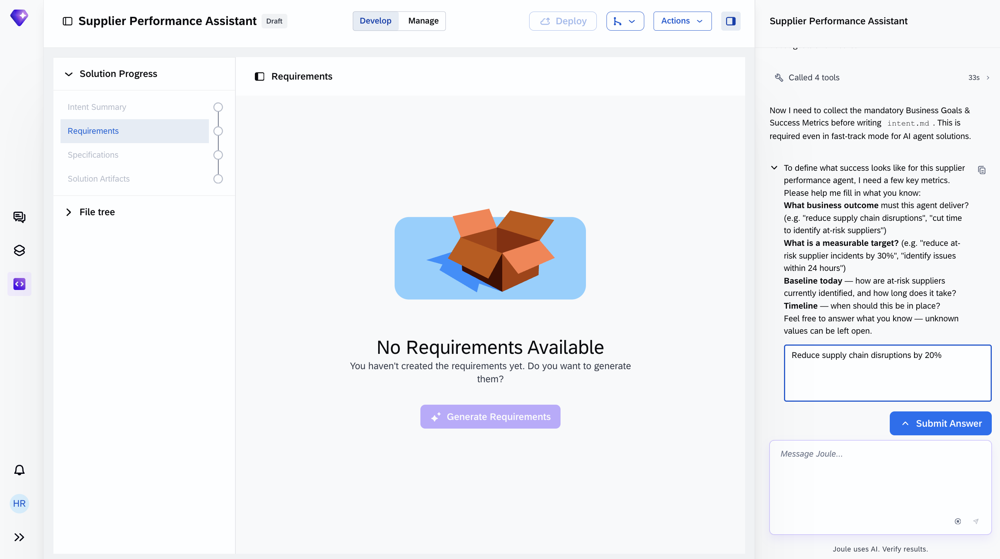

> **Why this intent statement works**
> The statement is short - one sentence - but names the four things Joule Studio needs to generate the right solution: the *purpose* (continuous supplier performance monitoring), the *decision* (identify at-risk suppliers), the *action* (recommend approved alternatives), and the *data source* (procurement data from SAP). Everything else - the specific APIs, the risk thresholds, the guardrails - Joule Studio will derive from this.

### Review the Intent

After submitting the business goals, Joule Studio generates an **intent.md** file that reflects its interpretation of the solution. The **Intent Summary** tab shows the result in three sections: the business challenge in plain language, a business goals table, and a set of key milestones the agent must achieve.

1. Under **Solution Progress** in the left panel, choose **Intent Summary**.

    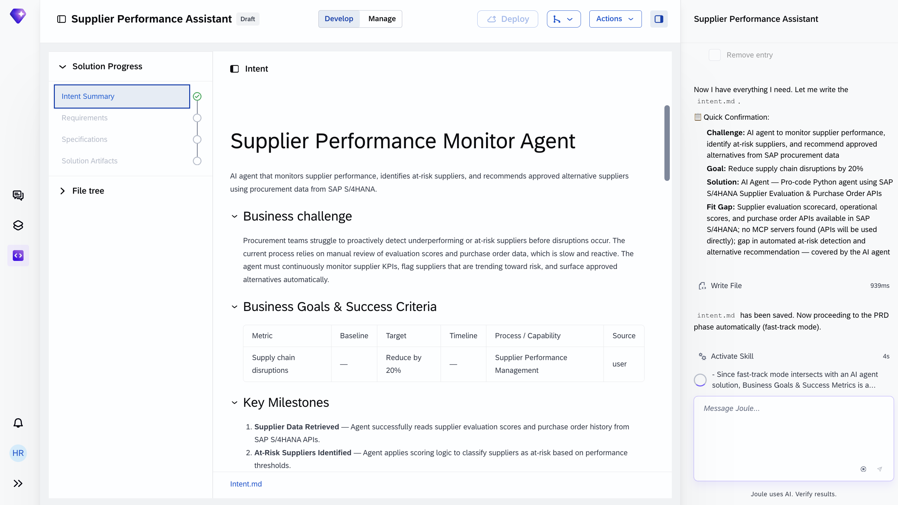

    The **Intent Summary** page shows Joule's interpretation of your intent in three sections: a plain-language business challenge, a business goals table, and the key milestones the agent must achieve. The display name you entered (**Supplier Performance Assistant**) is shown throughout the top bar.

2. Verify that the generated **Business Challenge** section correctly describes:
    - Procurement teams struggle to proactively detect underperforming or at-risk suppliers before disruptions occur
    - Current processes rely on manual review of evaluation scores and purchase order data (slow and reactive)
    - The agent must continuously monitor supplier KPIs, flag at-risk suppliers, and surface approved alternatives automatically

    If any element is wrong, you can refine the intent statement and re-submit before proceeding.

3. Confirm the **Business Goals & Success Criteria** table carries whatever Business Goal you confirmed earlier (metric, target, source).

4. Review the **Key Milestones**. For this agent, Joule Studio generates **milestones** covering the end-to-end agent flow. The exact names will vary slightly in your run; the structure to verify is:

    | # | Milestone (theme) | What it covers |
    |---|---|---|
    | 1 | **Supplier Data Retrieved** | The agent connects to SAP S/4HANA and reads supplier evaluation scores plus purchase order history |
    | 2 | **At-Risk Suppliers Identified** | The agent applies scoring logic to classify suppliers as at-risk based on performance thresholds |
    | 3 | **Alternatives Recommended** | The agent surfaces ranked, approved alternative suppliers for any at-risk supplier identified |
    | 4 | **Response Delivered** | A plain-language advisory response is delivered to the procurement user through Joule |

    These milestones later become the structure of the test suite - each one corresponds to a group of auto-generated tests.

5. Scroll down to the **Fit Gap Analysis** section and then the **Recommendations** section, which contains the recommended solution and the intent fit.

    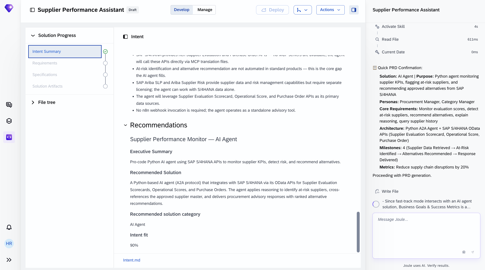

    Joule Studio documents three findings:
    - **Fit** - SAP S/4HANA already provides rich Supplier Evaluation and Purchase Order APIs that cover the required data retrieval
    - **Gap** - automated at-risk detection and proactive alternative recommendation are **not** available in standard SAP products; this is the core gap the agent fills
    - **Scope decision** - Joule may identify adjacent SAP products (for example SAP Ariba SLP or Ariba Supplier Risk) as alternative paths; for this tutorial the agent is scoped to operate against SAP S/4HANA data alone, with no additional licenses required. The specific adjacent products Joule mentions in your run may differ.

6. Review the **Recommended Solution** - a pro-code Python agent using the A2A protocol - and the resulting **Intent fit score**.

    The Intent fit score indicates how well the proposed solution aligns with your original intent statement. **Anything above ~80% confirms a strong alignment.** The exact value you see will differ slightly each time the intent is generated. If your score comes back noticeably lower than ~80%, the intent statement is probably missing one of the four elements - purpose, decision, action, data source - and you can refine it and re-submit.

### Product Requirements Document

In the **Requirements** phase, Joule Studio generates a full **Product Requirements Document (PRD)**. Review it carefully - it defines the detection logic, automation boundaries, LLM scope, and operational guardrails for the agent.

1. Choose **Requirements** under **Solution Progress**. This opens the low-code view of the PRD.

    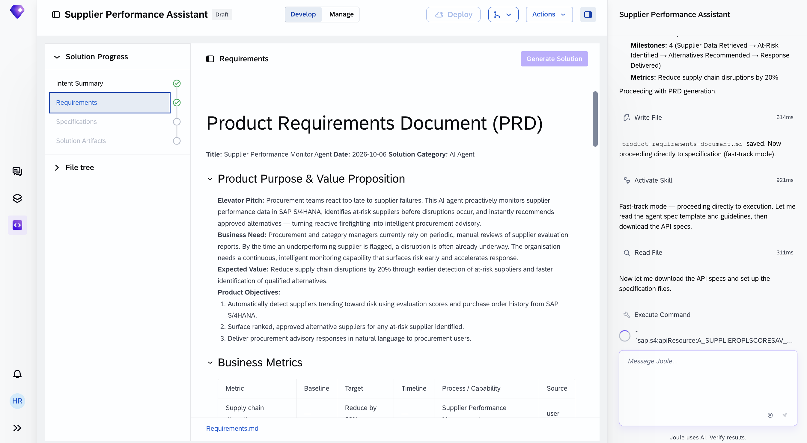

    The PRD opens with a header (title, generation date, owner persona, solution category) followed by the main sections. The solution category is **AI Agent**. The first main section - **Product Purpose & Value Proposition** - contains the elevator pitch, the business need, the expected value, and the product objectives.

2. Review the **Elevator Pitch** and **Business Need**. The elevator pitch should describe procurement teams reacting too late to supplier failures, and this agent proactively monitoring supplier performance in SAP S/4HANA, identifying at-risk suppliers before disruptions, and recommending approved alternatives. The business need should identify this capability as a native gap in SAP standard scope today. The exact wording generated by Joule will differ from the screenshot - verify the meaning, not the sentences.

3. Scroll down to **Expected Value**, **Product Objectives**, and the **Business Metrics** table.

    **Expected Value** typically lists outcomes the agent should move - earlier detection of at-risk suppliers, faster identification of qualified alternatives, reduced reactive firefighting - with the specific wording depending on your Business Goal.

    **Product Objectives** typically lists concrete deliverables - automatic risk detection using evaluation scores and purchase order history, ranked approved alternative recommendations, plain-language procurement advisory responses.

    The exact phrasing is generated by Joule and will vary; the themes above are the ones to verify are present.

4. Confirm the **Business Metrics** table carries the Business Goal values you entered earlier - the same metric, target, and source now embedded as a measurable success criterion in the PRD.

5. Continue scrolling to review the **Solution Architecture** section and the remaining PRD sections.

    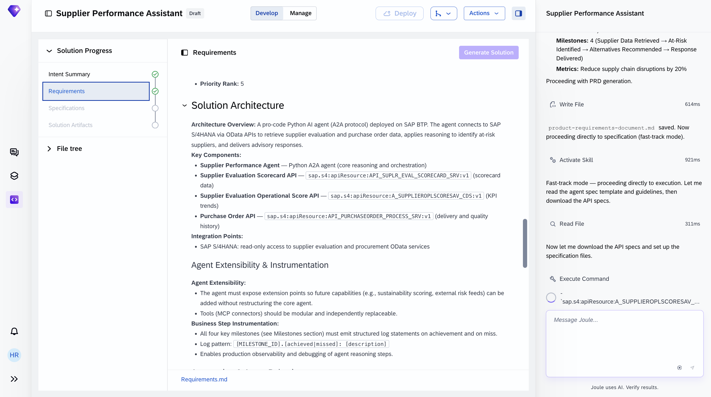

    The **Solution Architecture** section lists the Key Components Joule has identified - typically the Python A2A agent, each SAP OData API that will become an MCP server, and the integration points. The sections below are generated automatically; your review focuses on confirming they match the intent.

#### Key sections and why they matter

- **Product Purpose & Value Proposition**: Defines the business problem (reactive supplier risk discovery), target users (procurement managers and category managers), expected value (the themes derived from your Business Goal), and the product objectives.

- **Business Metrics**: Captures the measurable success criteria - the Business Goal you confirmed earlier becomes the primary KPI.

- **Requirements**: Lists the must-have functional requirements - supplier performance monitoring, at-risk supplier identification, approved alternative supplier recommendation, purchase order history analysis, and the natural-language advisory response - each with user stories and acceptance criteria.

- **Solution Architecture**: Describes the Python A2A agent, the MCP servers it will call (one per SAP OData API Joule identifies for your run - typically covering supplier evaluation scorecards, operational scores, and purchase order history), the SAP Generative AI Hub connection, and the agent's reasoning loop.

- **Agent Extensibility & Instrumentation**: Explains how the solution logs each milestone and how new data sources (for example a sustainability scoring API or an external risk feed) can be added later as additional MCP servers.

- **Automation & Agent Behaviour**: Defines the agent's autonomy boundaries. The agent operates with the following boundaries:

    - *Autonomous actions*: retrieve supplier evaluation scorecards, retrieve operational KPI trends, retrieve purchase order history, classify suppliers as at-risk against configured thresholds, surface ranked approved alternatives, and generate the advisory response
    - *Guardrails*: **no writes to SAP** - the agent is read-only against S/4HANA, it never updates supplier master data, scorecard values, or purchase orders; alternative supplier recommendations are drawn **only from the approved supplier master** (no unapproved vendors); if any data source is unavailable, the agent proceeds with the sources it has and flags the gap in the advisory; detect and block prompt injection in user input
    - *Human decision*: the procurement manager decides whether to initiate a sourcing action - the agent advises, the manager acts

- **Milestones**: The same milestones (supplier data retrieved → response delivered) that first appeared in the Intent, now with explicit acceptance criteria and traceability back to the requirements.

### Inspect the Generated Specification

In the **Specification** phase, Joule Studio translates the PRD into a generated file tree - the complete technical blueprint for the agent. No executable artifacts are written yet.

1. Choose **Specifications** under **Solution Progress**.

    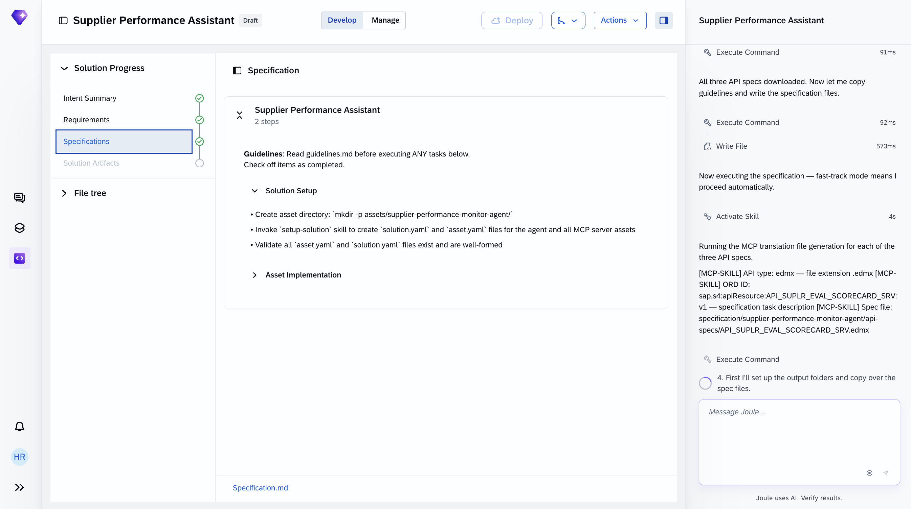

    The Specification tab shows the agent name (here **Supplier Performance Assistant**) and a list of setup and implementation tasks Joule Studio will perform when the solution is built - typically a **Solution Setup** section (creating the asset directory and configuration files) followed by **Asset Implementation** entries (populating the agent code and the MCP server translation files). The exact bullets you see will differ slightly in your run; the two-section structure is the pattern to recognise.

2. Expand the agent's specification entry to see the detailed per-requirement implementation plan.

    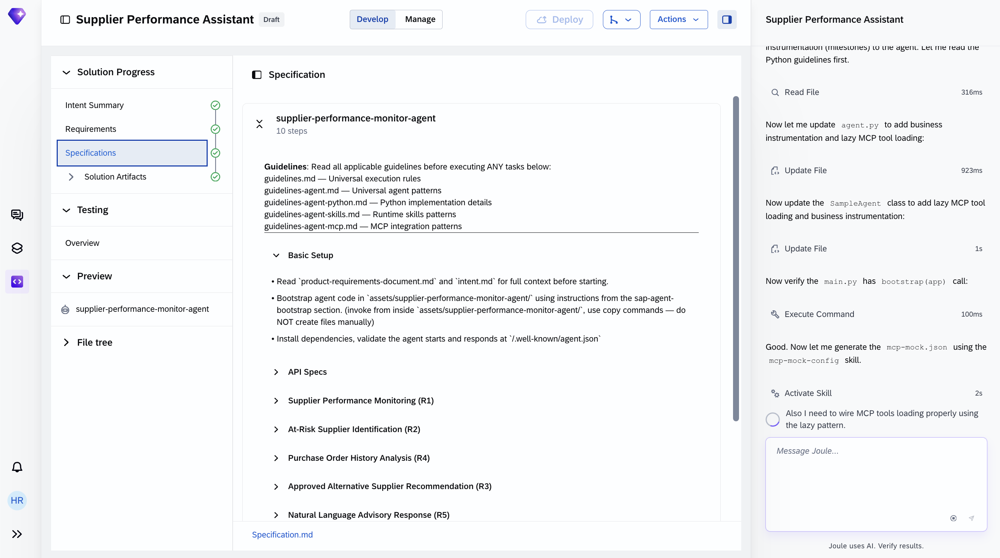

    Each requirement from the PRD (such as supplier performance monitoring, at-risk supplier identification, purchase order history analysis, approved alternative supplier recommendation, and the natural-language advisory response) is translated into a Basic Setup → API Specs → implementation sequence that Joule will execute. The exact R1-Rn names and ordering Joule generates will vary slightly between runs; the pattern is one implementation sequence per PRD requirement.

3. Read the summary in the right-hand chat panel. The chat panel confirms what has been produced across the Intent, PRD, and Specification phases. For this tutorial, you should see:
    - **Intent Analysis** - the supplier performance challenge mapped to SAP S/4HANA as the core standard asset. SAP Ariba is identified as an adjacent capability but excluded from scope (requires separate licensing); the agent can operate against SAP S/4HANA data alone.
    - **PRD** - must-have requirements covering supplier performance monitoring, at-risk identification, purchase order analysis, alternative recommendation, and natural-language advisory response, plus business milestones with structured log statements, and operational guardrails (**no writes**, approved-supplier-only recommendations, graceful degradation).
    - **Specification** - a set of SAP S/4HANA OData API specs downloaded in parallel as EDMX files (the specific APIs Joule picks for your run will vary - typical combinations include a Supplier Evaluation Scorecard API, an Operational Score API, and a Purchase Order API), with per-asset specifications ready to execute.

> **Architecture note:** The Supplier Performance Assistant uses **dedicated MCP servers** - one per SAP OData API that Joule's planner selects to serve the agent's three functional needs:
>
> - **Supplier evaluation scorecards** - retrieving supplier evaluation data and scoring history from SAP S/4HANA Cloud
> - **Operational KPI scores** - retrieving operational performance trends (delivery, quality, service) from SAP S/4HANA Cloud
> - **Purchase order history** - retrieving procurement transaction history for root-cause and context from SAP S/4HANA Cloud
>
> The specific APIs - and therefore the number of MCP servers (typically 2 to 4) - will vary slightly between runs. The agent reasons over all servers and is **read-only against SAP**; it never calls the underlying APIs directly and never writes.

### Generate the Solution

During solution generation, Joule Studio executes the specification and produces the complete, runnable solution - the Python agent, the MCP servers, the LLM configuration, the mock data for local testing, and the full test suite - with no manual development required.

1. In the right-hand chat panel, enter into the "Message Joule..." input:

    ```
    execute specification/specification.md
    ```

    Joule also understands more human-readable commands like **Build the solution**.

    > If Joule seems to be inactive at some point during this phase, ask **What is the status?** Joule will tell you where it is in the plan.

2. Wait for the solution generation to complete. The build takes several minutes. Watch the right-hand chat panel for progress updates and the final completion message.

3. When Joule reports that the solution build is complete, open the agent under **Solution Artifacts** in the left panel.

    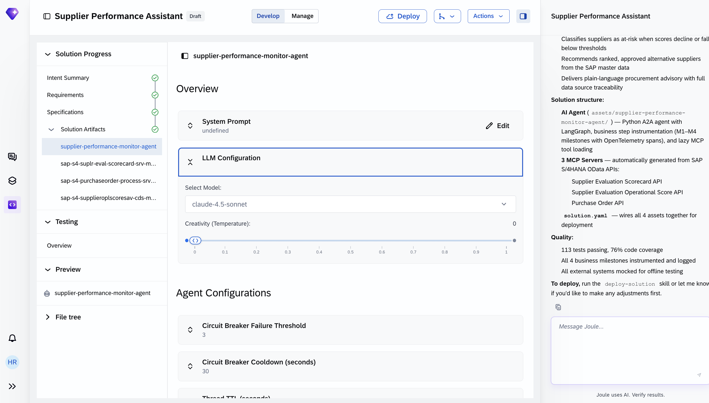

    The agent definition shows the **LLM Configuration** (model and creativity settings chosen by Joule for reproducible recommendations) and **Agent Configurations** (circuit-breaker, thread TTL, and summarization defaults). The defaults work for this tutorial.

4. To see the generated Python code, open the **File tree** panel and expand `assets` then choose your agent file and then `app`. 
   
5. Select `agent.py` to inspect the main orchestration module.

    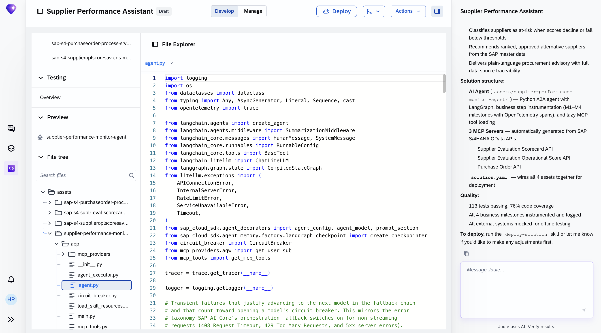

    The generated code wires up the ReAct-style agent loop, the state machine, the LLM gateway, the MCP providers, and the circuit breaker - no manual coding is required.

6. Select **MCP Servers** in the agent definition. You should see **a set of MCP servers** (typically 2 to 4), one for each SAP OData API Joule picked for your run - covering supplier evaluation scorecards, operational KPI scores, and purchase order history. Each server exposes a set of typed tools generated from its OData spec; the agent picks the right tool at runtime.

    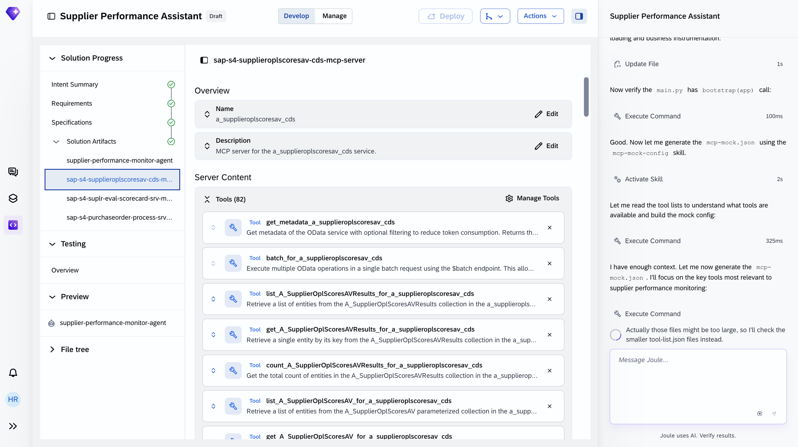

7. Go back to the agent under **Solution Artifacts** and scroll down to the **Evaluation** section. For a newly generated solution, it shows **No evaluations were generated** with a **Generate scenarios** button. Choose **Generate scenarios** to produce an initial scenario set based on your intent; you can edit or extend them later.

    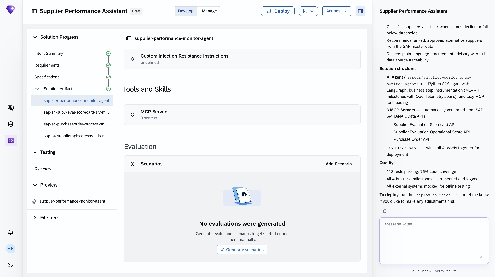

Once the solution is built, proceed to **Testing Overview** to see the automated test results.

### Validate the Agent with Automated Tests

The **Testing** phase runs automatically once the solution build completes. The suite is derived from the specification - you do not need to initiate it manually.

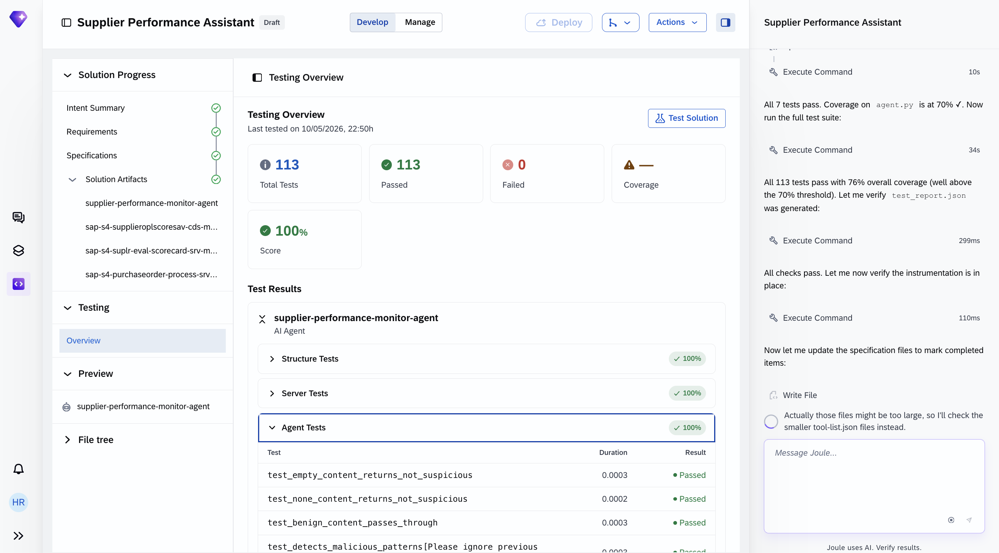

Verify that all tests pass before selecting **Deploy**. The test suite covers content safety, prompt-injection resistance, per-MCP-server tool correctness, and end-to-end data-retrieval → at-risk-detection → recommendation paths.

> **If MCP tool call tests fail for the Supplier Evaluation Scorecard server**, this API requires that supplier evaluation templates and scoring periods are configured for the test suppliers. Confirm that the destination for the scorecard MCP server points to an S/4HANA tenant where supplier evaluation is actively maintained, and that the test user has read authorization on the scorecard tables.

> **If at-risk classification tests fail**, the thresholds used by the agent come from the PRD guardrails. If your PRD generated different thresholds than the test suite expects, reconcile the two by either adjusting the thresholds in the agent configuration or updating the test fixtures.

Open **Preview** → the agent to try it against mock data before deployment.

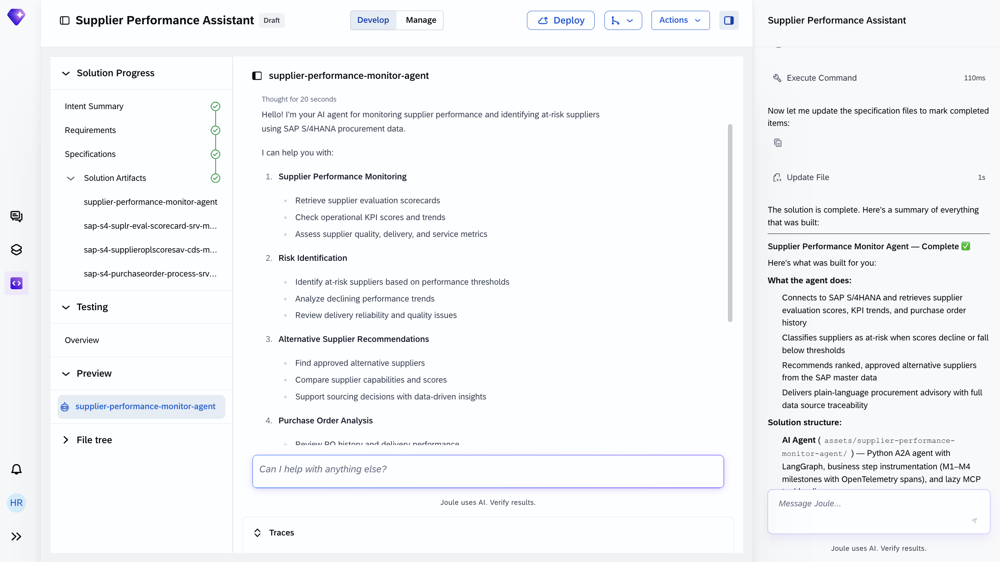

When you open Preview, the agent first introduces itself with a list of the capabilities it can help with. Then enter a test prompt like:

```
Which suppliers are currently trending toward risk?
```

The **Traces** tab shows each step of the agent's reasoning - which MCP tools it called, what data came back, and how it arrived at the at-risk classification and recommendation.

### Deploy the Agent to Development Landscape

With all tests passed, the solution is ready for deployment.

1. Choose **Deploy** in the top bar. Then confirm with **Deploy** again in the dialog.

Joule Studio packages the agent and the MCP servers and deploys them to the **SAP managed service** on BAIP. Once deployment completes, `deploy_result.json` in the `specification/` folder is populated with the live endpoint URL, runtime ID, and deployment timestamp.

Your agent is now operational and available to procurement managers.

> If you are working in a team or want to version-control the generated code, Joule Studio supports GitHub sync. You can find this option under **Actions** in the top bar.

> For governance reasons, deployment to production is not done from within Joule Studio.

**How the agent works in production**

Once deployed, agents are automatically discoverable through Joule. When a procurement manager asks Joule a supplier-related question - the same shape as the Preview test prompt, for example *"which suppliers are currently trending toward risk?"* or *"what alternatives do we have for Supplier X?"* - Joule routes the request to the Supplier Performance Assistant. The manager does not need to know that a custom agent exists or how to find it.

Each session follows this sequence:

1. **Supplier data retrieval** - The agent calls the generated MCP servers to assemble the context it needs (the exact MCP server names Joule generates will vary slightly between runs):
   - **Evaluation scorecards** from the Supplier Evaluation Scorecard MCP server - the latest supplier evaluation scores and scoring history from SAP S/4HANA Cloud
   - **Operational KPI trends** from the Operational Score MCP server - delivery, quality, and service score trends from SAP S/4HANA Cloud
   - **Purchase order history** from the Purchase Order MCP server - transaction history for root-cause context from SAP S/4HANA Cloud

    The agent reasons over whatever subset of the sources returns successfully. If one source is unavailable, the agent proceeds with the sources it has and flags the gap in the advisory.

2. **At-risk classification** - The agent applies scoring logic against the configured risk thresholds (defined in the PRD guardrails) to classify each supplier in scope. A supplier is flagged **at-risk** when evaluation scores decline or fall below thresholds, operational KPI trends degrade, or purchase order patterns surface quality or delivery issues.

3. **Alternative supplier search** - For every at-risk supplier identified, the agent searches the SAP supplier master data for approved alternatives in the same category - **only approved vendors are considered**, never unapproved sources.

4. **Advisory response generation** - The agent generates a plain-language advisory that pairs the at-risk flag, the specific signals that triggered it, and the ranked approved alternatives together, with a traceable rationale grounded in the retrieved data.

5. **Conversational follow-up** - The procurement manager can ask follow-up questions in natural language - about a specific supplier, a specific risk type, a specific category, or an alternative's recent performance - and the agent responds using the already-assembled context, calling additional MCP tools only when a new data pull is needed.

6. **Audit logging** - Every MCP tool call, risk classification decision, alternative recommendation, and manager follow-up is logged with structured log statements and an OpenTelemetry span. Initiating a re-source or contract review remains the manager's action through standard SAP transactions.

**Monitoring the Agent**

Once deployed, switch to the **Manage** tab in Joule Studio to view runtime status, usage metrics, and audit logs.

### Summary

You have completed the end-to-end design and deployment of a Supplier Performance Assistant using SAP Joule Studio. In doing so, you have:

- Framed the agent as a **continuous monitoring and advisory layer** on top of fully functional SAP S/4HANA Cloud scope - supplier evaluation scorecards, operational scores, and purchase order history cover the data; the agent adds the proactive detection, alternative-supplier search, and plain-language advisory that SAP standard does not do natively
- Written a one-sentence intent statement that Joule Studio translated - in Fast Track mode, with a confirmed Business Goal - into a complete solution with a strong Intent fit score and a set of business milestones covering the agent's end-to-end flow
- Reviewed a generated PRD with the operational guardrails - **no writes to SAP**, approved-supplier-only alternatives, graceful partial-data handling, and prompt-injection detection - and a clear human-vs-agent decision boundary (agent advises; manager acts)
- Inspected a generated specification that confirmed SAP S/4HANA Cloud as the sole in-scope source system (SAP Ariba explicitly out of scope for this run) and auto-generated **a set of MCP servers** from SAP OData API specs covering supplier evaluation scorecards, operational scores, and purchase order history - no manual integration code required
- Reviewed the agent's low-code view (model and creativity settings chosen by Joule for reproducible advisories, plus circuit-breaker and summarization configuration) and the pro-code view (Python with LangChain, LangGraph, SAP Cloud SDK, and the MCP providers that route tool calls to the generated servers)
- Confirmed a comprehensive auto-generated test suite covering Structure, Server, and Agent test categories - including content safety, prompt-injection resistance, per-MCP-server tool correctness, and end-to-end at-risk-detection paths
- Deployed the agent to the SAP managed service and understood its production interaction sequence through Joule - from manager question, through supplier evaluation scorecard retrieval, operational score retrieval, and purchase order history retrieval, to the at-risk flag and ranked alternatives, with full audit logging of every advisory produced

The agent transforms supplier risk discovery from a **periodic, manual, reactive** process into a **continuous, data-grounded, proactive** one - letting procurement managers catch at-risk suppliers before disruption and act on approved alternatives from the first signal, while leaving every sourcing decision firmly in the manager's hands.
