# Build an AI Sales Assistant Agent with Joule Studio, SAP Sales Cloud, and SAP S/4HANA Cloud

## Prerequisites

- Access to **Joule Studio**
- Access to an **SAP S/4HANA Cloud** system with:
  - Customer sales order history retrievable via the Sales Order OData API
  - Pricing conditions, margin configuration, and server-side margin reasoning (via Pricing Conditions or Sales Order Simulation OData APIs) accessible for the relevant sales areas
- Access to **SAP Sales Cloud** with open opportunity, deal stage, and forecasting data retrievable via the Opportunity OData API for the sales reps in scope
- Familiarity with the opportunity-to-order sales process across SAP Sales Cloud and SAP S/4HANA Cloud

## You will learn

- How to identify a sales workflow that benefits from a data-grounded discount recommendation
- How to write a two-sentence intent statement that lets Joule Studio generate the whole solution in Fast Track mode
- How Joule Studio turns the intent into a Product Requirements Document (PRD), a Specification, and auto-generated MCP server integrations - with no manual coding
- How to review the generated agent, run the auto-generated test suite, and try the agent in Preview before deployment
- How the deployed agent gives a sales rep contextualized discount recommendations - discount range, margin impact, risk level, and rationale - inside Joule's conversational interface

## Intro

>**IMPORTANT**
>
>**Welcome to the Agent lab**
>
>You are working with a pre-release version of the Joule Studio. This gives you an early look at our upcoming capabilities. Please keep the following in mind:
>
> - **Features are subject to change:** The UI, terminology, and functionality you see may differ from the final product.
> - **Educational use only:** This environment is designed for learning and experimentation, not for production use.
> - **Potential instability:** As a preview version, you may encounter occasional instability or unexpected behavior.

Every sales negotiation turns on the same question: *how much discount can I offer, and how do I justify it?* Today, a sales rep answering that question has to cross-reference customer order history in SAP S/4HANA Cloud, open opportunity data in SAP Sales Cloud, and margin targets across the SAP landscape - then simulate the margin impact of a discount in their head. The decision is usually made from gut feel, and the margin impact only shows up at month-end.

In this tutorial, you build an **AI Sales Assistant** using Joule Studio. The agent reasons over live SAP data - customer order history, pipeline context, and pricing/margin signals from across SAP Sales Cloud and SAP S/4HANA Cloud - and gives the rep a structured discount recommendation (range, margin impact, risk level, and rationale) at the point of negotiation.

You will move through all phases of the Joule Studio intent-based development process: from a plain-language intent statement to a deployed Python agent that calls the SAP APIs through auto-generated MCP servers.

> **About the scenario:** The customer, order, and margin values referenced in this tutorial are illustrative. The agent pattern applies to any organisation running the opportunity-to-order process across SAP Sales Cloud and SAP S/4HANA Cloud.

> **Why discount strategy is a strong automation candidate?** The decision has a well-defined trigger (a rep considering a discount for an open deal), a bounded set of input data (order history, pipeline status, margin targets, pricing simulation), a structured output (a discount recommendation with rationale), and a clear success criterion (higher deal margin at protected win rate). Those characteristics make it an ideal target for a recommendation agent that augments the rep's judgement rather than replacing it.

---

### Understand the Business Challenge

Before building the agent, it is important to understand the typical scenarios the agent must handle and the manual pain points it eliminates.

**Three typical discount scenarios**

A sales rep considering a discount is almost always in one of three situations. The agent reasons about each one differently - using different signals from across SAP Sales Cloud and SAP S/4HANA Cloud - which is why the intent statement explicitly names both source systems.

| Scenario | What the rep is actually facing | What the agent uses to help |
|----------|---------------------------------|------------------------------|
| **Repeat customer renewing or re-ordering** | A known customer with purchasing history. The question is how to protect margin without losing a predictable deal. | **Order history** from SAP S/4HANA Cloud - what this customer bought, at what price, how often, with what payment behaviour - plus **current margin** from the pricing/margin API in S/4HANA |
| **New prospect with an aggressive discount ask** | An unknown customer, no purchasing history, often an upfront discount request to "earn the business". The question is how much to concede on margin to win the first deal. | **Opportunity data** from SAP Sales Cloud - deal stage, forecast, competitive context - plus the **margin floor** from the pricing/margin API to find the safest discount that still clears the floor |
| **Strategic account mid-cycle** | A major account already in-flight on an opportunity, now asking for a mid-cycle discount concession. The question is how to decide without stalling the deal. | All sources together - **history** (is this consistent with past behaviour?), **pipeline** (what else is open with this account?), and **margin reasoning** (what does this discount do to the deal margin right now?) |

**Current pain points**

The manual approach to discount decisions creates well-understood operational challenges that sit on top of fully functional SAP standard scope:

- **Data lives across two systems, the decision happens in one head** - customer order history is in SAP S/4HANA Cloud, open opportunities and pipeline health are in SAP Sales Cloud, and margin targets are maintained in SAP S/4HANA pricing configuration. The rep is the integration layer, done manually, in real time, under negotiation pressure.
- **No in-the-moment reasoning across the two systems** - SAP Sales Cloud and SAP S/4HANA Cloud each cover their part of the process and expose APIs for the data. What is missing is an AI layer that correlates all three signals into a single discount recommendation at the point of negotiation.
- **Margin impact of a discount is invisible until posting** - the rep offers a discount percentage without seeing what it does to the margin until the quotation is converted. SAP S/4HANA has APIs that can produce that number (pricing conditions, order simulation), but they are not surfaced at the point of quoting.
- **No rationale attached to the number** - the discount offered is rarely written down with its reasoning. When margin erodes at month-end, there is no trace of why that specific percentage was chosen for that specific deal.
- **Inconsistent discounting across the team** - without a shared recommendation layer, every rep applies their own heuristic. Discount-band consistency across the sales organisation is impossible to achieve from training alone.

> The agent you build in this tutorial retrieves customer order history and margin signals from SAP S/4HANA Cloud, pipeline and opportunity data from SAP Sales Cloud, correlates them into a single ranked discount recommendation with rationale, and surfaces it to the rep inside Joule's conversational interface at the point of negotiation.

### Open Joule Studio and Define the Agent Intent

The **Intent** phase is the starting point of every agent in Joule Studio. You describe what you want the agent to do in plain business language. No technical specification required at this stage.

1. Open **Joule Work** - the SAP portal that hosts Joule Studio and other developer-facing capabilities - and navigate to **Joule Studio** by selecting the **`<>`** icon in the left navigation panel.

    The **Create a new solution** page opens with four solution types.

    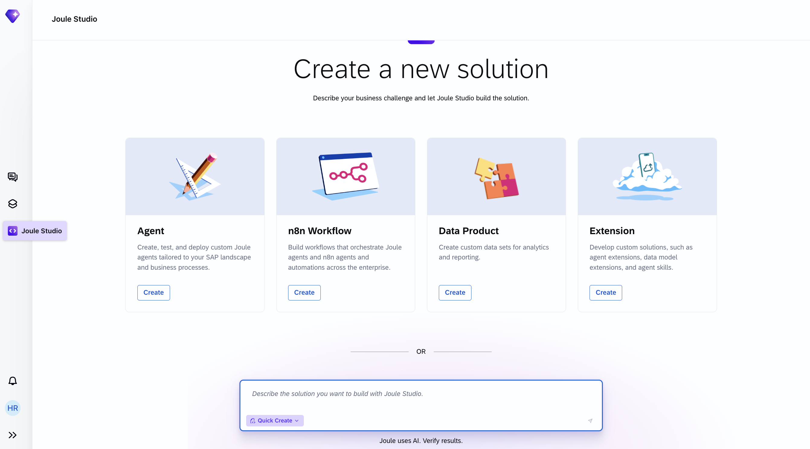

2. On the **Agent** tile, choose **Create** to open the **Create Agent** dialog.

3. Complete the three fields in the dialog:

    - **Solution**: Leave **New Solution** selected to create this agent as a standalone solution.
    - **Name**: Enter the following agent name:
        ```
        AI Sales Assistant
        ```
    - **Intent Statement**: Enter the following statement in plain business language:
        ```
        AI-powered discount strategy suggestion agent that analyzes customer orders, pipeline
        and margin targets from SAP Sales Cloud and SAP S/4HANA Cloud, providing sales reps
        with contextualized discount recommendations.
        ```

    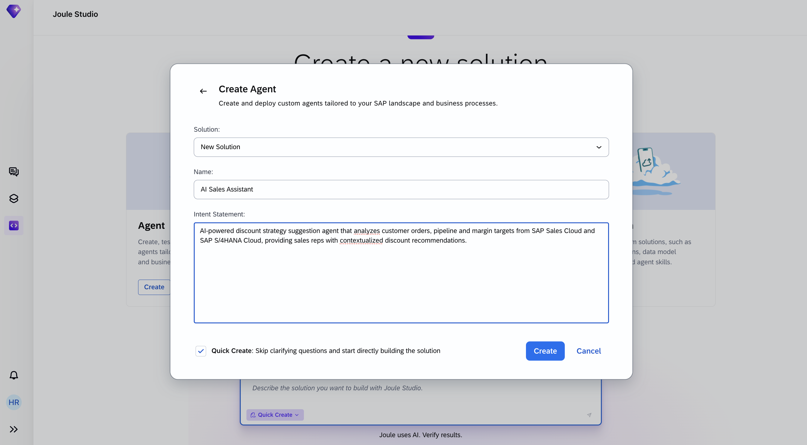

4. At the bottom-left of the dialog, verify that **Quick Create** is active (it is on by default). Quick Create activates *Fast Track* mode, which skips the clarifying-question loop and runs the whole pipeline (Intent → PRD → Specification → Build → Test) automatically. You will still be asked to confirm the Business Goals - that step is mandatory even in Fast Track.

5. Select **Create** to proceed.

6. Confirm the **Business Goals & Success Criteria** when Joule asks. Even in Fast Track mode, this one confirmation step is mandatory.

    > **Business Goals can take several forms** - Joule may ask for a single measurable outcome in a free-text input, present a set of pre-defined checkboxes to pick from, or ask several follow-up questions in sequence (business outcome, measurable metric, baseline, timeline).
    >
    > **How to answer in any form**: pick or enter at least one measurable business metric for this discount recommendation agent - for example *improve margins by 2%*, or *increase deal win rate from 30% to 40%*. For any follow-up on **baseline** or **timeline** you don't know, it is fine to answer *"no baseline yet"* or *"use defaults"*. Keep selecting **Submit Answer** after each question until Joule starts writing `intent.md`.

    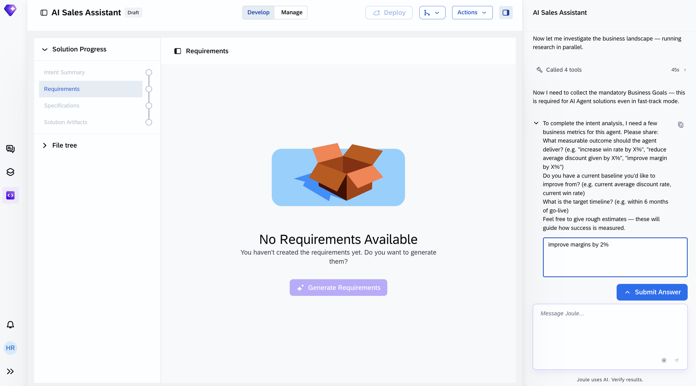

> **Why this intent statement works**
> The statement is short - two sentences - but names the four things Joule Studio needs to generate the right solution: the *purpose* (discount strategy recommendation), the *source systems* (SAP Sales Cloud and SAP S/4HANA Cloud), the *data* (customer orders, pipeline, margin targets), and the *user* (sales reps). Everything else - the specific APIs, the reasoning logic, the guardrails - Joule Studio will derive from this.

### Review the Intent

After submitting the business goals, Joule Studio generates an **intent.md** file that reflects its interpretation of the solution.

1. Under **Solution Progress** in the left panel, choose **Intent Summary**.

    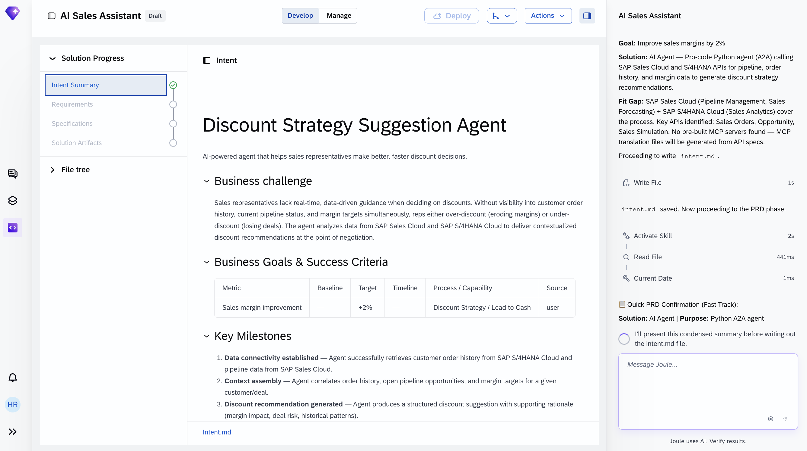

    The **Intent Summary** page shows Joule's interpretation of your intent in three sections: a plain-language business challenge, a business goals table, and the key milestones the agent must achieve. The display name you entered (**AI Sales Assistant**) is shown throughout the top bar.

2. Verify that the generated **Business Challenge** section correctly describes:
    - Reps lack a real-time, data-driven view across order history, pipeline, and margin targets
    - The result today is over-discounting (margin erosion) or under-discounting (lost deals)
    - The agent delivers contextualized recommendations at the point of negotiation

    If any element is wrong, you can refine the intent statement and re-submit before proceeding.

3. Confirm the **Business Goals & Success Criteria** table captures whatever Business Goal you confirmed earlier (metric, target, source). This is the value echoed back from Fast Track - the exact wording depends on what you entered or selected.

4. Review the **Key Milestones**. For this agent, Joule Studio generates **milestones** covering the end-to-end agent flow. The exact names will vary slightly in your run; the structure to verify is:

    | # | Milestone (theme) | What it covers |
    |---|---|---|
    | 1 | **Data connectivity** | The agent connects to SAP data sources and retrieves order history and pipeline data |
    | 2 | **Context assembly** | The agent correlates order history, open opportunities, and margin targets for a given customer or deal |
    | 3 | **Recommendation generated** | The agent produces a structured discount recommendation with margin impact, deal risk, and rationale |
    | 4 | **Rep interaction** | The agent exposes a natural-language interface for conversational refinement |
    | 5 | **Outcome tracked** | Agent actions are instrumented for observability and later analysis |

    These milestones later become the structure of the test suite - each one corresponds to a group of auto-generated tests.

5. Scroll down to the **Fit Gap Analysis** section and then **Recommendations** section, which contains the recommended solution and the intent fit.

    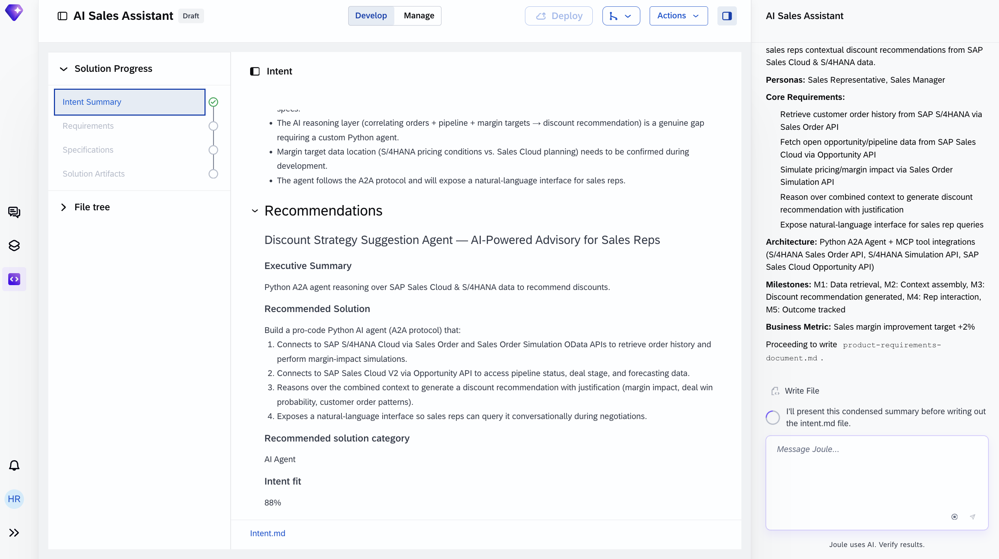

    Joule Studio documents three findings:
    - **Fit** - SAP Sales Cloud (pipeline management, sales forecasting) and SAP S/4HANA Cloud (sales analytics, order history) cover the underlying data and process
    - **Gap** - the AI reasoning layer that correlates orders, pipeline, and margin targets into a discount recommendation is genuinely new and requires a custom Python agent
    - **Confirmation needed during development** - the exact location of margin target data (S/4HANA pricing conditions vs. planning data) will be resolved as the specification is built

6. Review the **Recommended Solution** - a pro-code Python agent using the A2A protocol - and the resulting **Intent fit score**.

    The Intent fit score indicates how well the proposed solution aligns with your original intent statement. **Anything above ~80% confirms a strong alignment.** The exact value you see will differ slightly each time the intent is generated. If your score comes back noticeably lower than ~80%, the intent statement is probably missing one of the four elements - purpose, source systems, data, user - and you can refine it and re-submit.

### Product Requirements Document

In the **Requirements** phase, Joule Studio generates a full **Product Requirements Document (PRD)**. Review it carefully - it defines the recommendation logic, automation boundaries, LLM scope, and operational guardrails for the agent.

1. Choose **Requirements** under **Solution Progress**. This opens the low-code view of the PRD.

    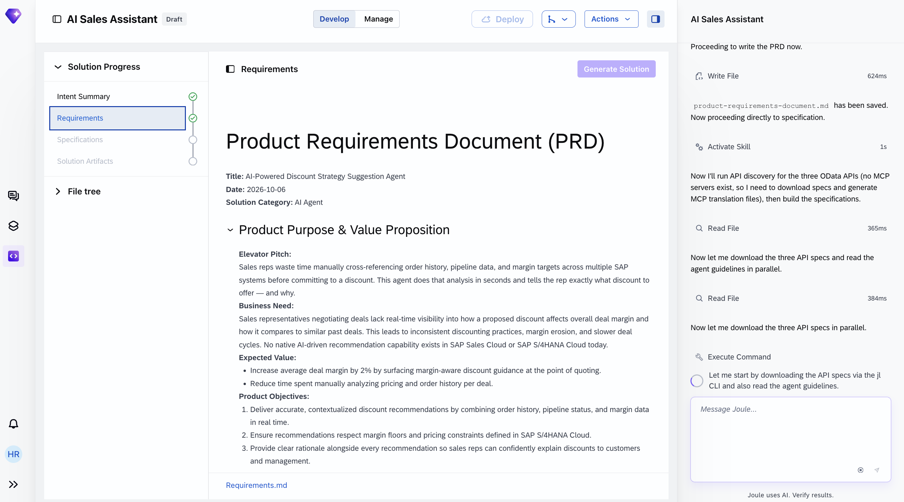

    The PRD opens with a header (title, generation date, owner persona, solution category) followed by the main sections. The solution category is **AI Agent**. The first main section - **Product Purpose & Value Proposition** - contains the elevator pitch, the business need, the expected value, and the product objectives.

2. Review the **Elevator Pitch** and **Business Need**. The elevator pitch should describe reps lacking an instant, consolidated view across order history, pipeline, and margin targets - and this agent giving them a data-driven recommendation at the point of negotiation. The business need should identify this capability as a native gap in the SAP landscape today. The exact wording generated by Joule will differ from the screenshot - verify the meaning, not the sentences.

3. Scroll down to **Expected Value**, **Product Objectives**, and the **Business Metrics** table.

    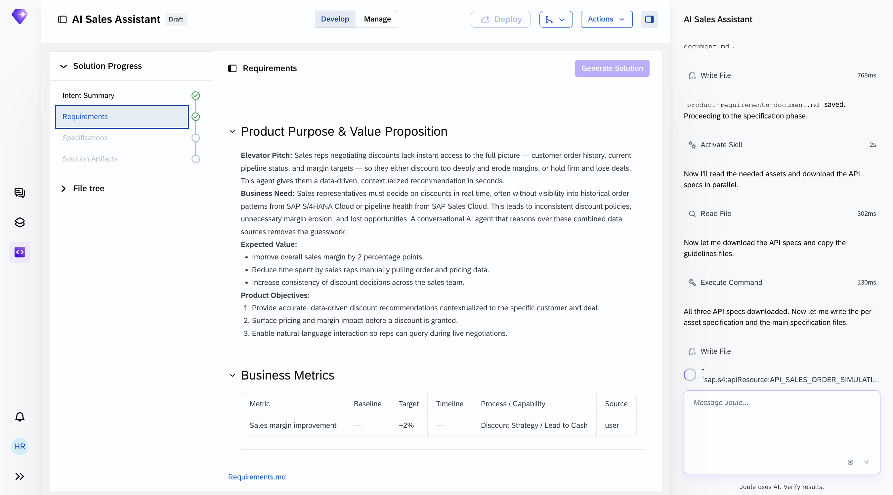

    **Expected Value** typically lists 2-3 outcomes the agent should move - the specific themes depend on the Business Goal you confirmed (for example, margin improvement, win-rate increase, time saved, or consistency across the sales team).

    **Product Objectives** typically lists 2-3 concrete deliverables - data-driven recommendations contextualized to the deal, pricing and margin impact surfaced before granting the discount, and natural-language interaction during negotiations.

    The exact phrasing is generated by Joule and will vary; the themes above are the ones to verify are present.

4. Confirm the **Business Metrics** table carries the Business Goal values you entered earlier - the same metric, target, and source now embedded as a measurable success criterion in the PRD.

5. Continue scrolling to review the remaining PRD sections. The sections below are generated automatically; your review focuses on confirming they match the intent.

#### Key sections and why they matter

- **Product Purpose & Value Proposition**: Defines the business problem (margin erosion from fragmented data), target users (sales reps and sales managers), expected value (the themes derived from your Business Goal), and the product objectives.

- **Business Metrics**: Captures the measurable success criteria - the Business Goal you confirmed earlier becomes the primary KPI.

- **Requirements**: Lists the must-have functional requirements - order history retrieval, pipeline data retrieval, margin reasoning, contextual recommendation generation, and the natural-language interface - each with user stories and acceptance criteria.

- **Solution Architecture**: Describes the Python A2A agent, the MCP servers it will call (one per SAP OData API Joule identifies for your run - typically covering order history, pricing/margin reasoning, and pipeline/opportunity context), the SAP Generative AI Hub connection, and the agent's reasoning loop.

- **Agent Extensibility & Instrumentation**: Explains how the solution logs each milestone and how new data sources (for example a competitive-intelligence feed) can be added later as additional MCP servers.

- **Automation & Agent Behaviour**: Defines the agent's autonomy boundaries. The agent operates with the following boundaries:

    - *Autonomous actions*: retrieve order history, retrieve opportunity data, run server-side margin reasoning (via pricing or simulation APIs), correlate the sources, and generate the recommendation with rationale
    - *Guardrails*: **no writes to SAP** - the agent reads data and runs server-side margin reasoning only, it never posts or updates quotations, pricing conditions, or master data; flag **HIGH RISK** and advise escalation if a proposed discount drops projected margin below the configured margin floor; gracefully handle partial data when one data source is unavailable; detect and block prompt injection in user input
    - *Human decision*: the sales rep decides whether to apply the recommended discount - the agent recommends, the rep acts

- **Milestones**: The same five milestones (data connectivity → outcome tracked) that first appeared in the Intent, now with explicit acceptance criteria and traceability back to the requirements.

### Inspect the Generated Specification

In the **Specification** phase, Joule Studio translates the PRD into a generated file tree - the complete technical blueprint for the agent. No executable artifacts are written yet.

1. Choose **Specifications** under **Solution Progress**.

    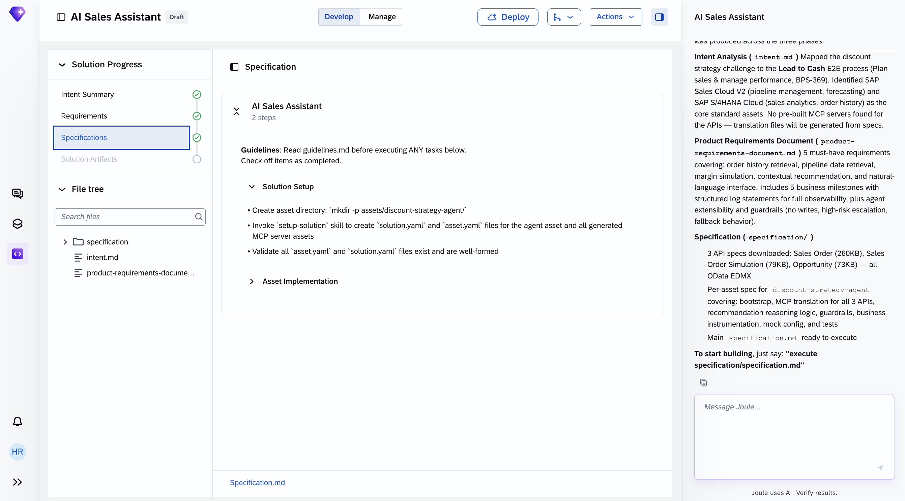

    The Specification tab shows the agent name (**AI Sales Assistant**) and a list of setup and implementation tasks Joule Studio will perform when the solution is built - typically a **Solution Setup** section (creating the asset directory and configuration files) followed by **Asset Implementation** entries (populating the agent code and the MCP server translation files). The exact bullets you see will differ slightly in your run; the two-section structure is the pattern to recognise.

2. Read the three-phase summary in the right-hand chat panel. The chat panel confirms what has been produced across the Intent, PRD, and Specification phases. For this tutorial, you should see:
    - **Intent Analysis** - the discount strategy challenge mapped to a Lead to Cash E2E process (**Plan sales & manage performance, BPS-369** is typical). SAP Sales Cloud and SAP S/4HANA Cloud are identified as the core standard assets. Because no pre-built MCP servers exist for these APIs, Joule Studio will generate the translation files from the API specs.
    - **PRD** - must-have requirements covering order history retrieval, pipeline data retrieval, margin reasoning, contextual recommendation, and natural-language interface, plus business milestones with structured log statements, and operational guardrails (**no writes**, high-risk escalation, fallback behaviour).
    - **Specification** - a set of SAP OData API specs downloaded in parallel as EDMX files (the specific APIs Joule picks for your run will vary - typical combinations include a Sales Order API, a pricing/simulation API, and an Opportunity API), with per-asset specifications ready to execute.

> **Architecture note:** The AI Sales Assistant uses **dedicated MCP servers** - one per SAP OData API that Joule's planner selects to serve the agent's three functional needs:
>
> - **Customer and order context** - retrieving sales orders and customer history from SAP S/4HANA Cloud
> - **Pricing or margin reasoning** - either a Pricing Conditions API or a Sales Order Simulation API from SAP S/4HANA Cloud, depending on Joule's run
> - **Pipeline and opportunity data** - retrieving open opportunities and deal stage from SAP Sales Cloud
>
> The specific APIs - and therefore the number of MCP servers (typically 2 to 4) - will vary slightly between runs. The agent reasons over all servers and is **read-only against SAP**; it never calls the underlying APIs directly and never writes.

### Generate the Solution

During solution generation, Joule Studio executes the specification and produces the complete, runnable solution - the Python agent, the MCP servers, the LLM configuration, the mock data for local testing, and the full test suite - with no manual development required.

1. In the right-hand chat panel, enter into the "Message Joule..." input:

    ```
    execute specification/specification.md
    ```

    Joule also understands more human-readable commands like **Build the solution**.

    > If Joule seems to be inactive at some point during this phase, ask **What is the status?** Joule will tell you where it is in the plan.

2. Wait for the solution generation to complete. The build takes several minutes. Watch the right-hand chat panel for progress updates and the final completion message.

3. When Joule reports that the solution build is complete, open the agent under **Solution Artifacts** in the left panel.

    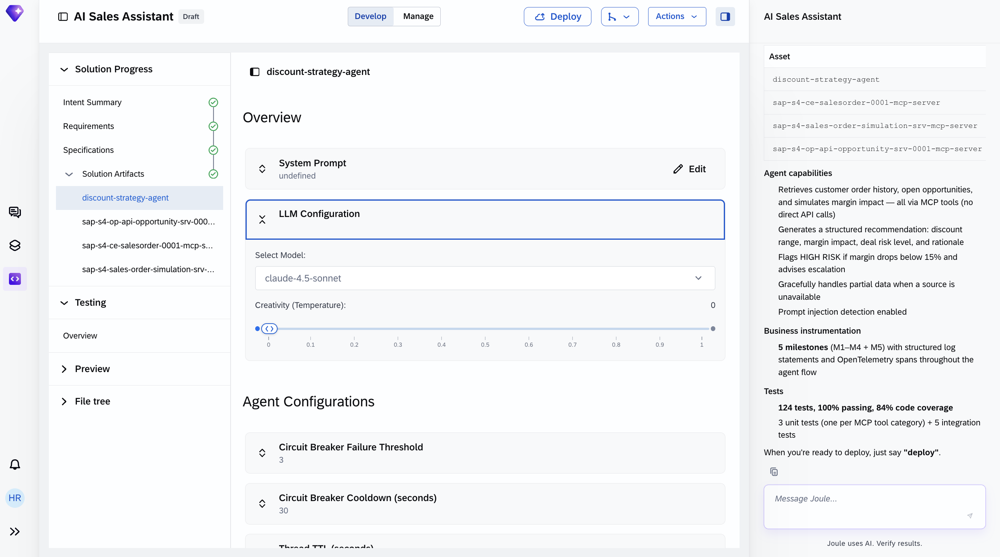

    The agent definition shows the **LLM Configuration** (model and creativity settings chosen by Joule for reproducible recommendations) and **Agent Configurations** (circuit-breaker, thread TTL, and summarization defaults). The defaults work for this tutorial.

4. To see the generated Python code, open the **File tree** panel and expand `assets` then choose your agent file and then `app`. 
   
5. Select `agent.py` to inspect the main orchestration module.

    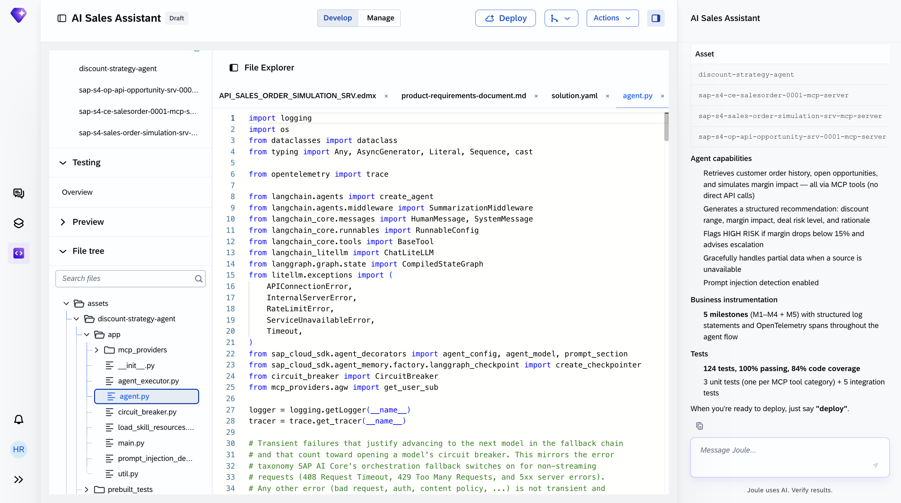

    The generated code wires up the ReAct-style agent loop, the state machine, the LLM gateway, the MCP providers, and the circuit breaker - no manual coding is required.

6. Select **MCP Servers** in the agent definition. You should see **a set of MCP servers** (typically 2 to 4), one for each SAP OData API Joule picked for your run - covering order history, pricing/margin reasoning, and pipeline/opportunity context. Each server exposes a set of typed tools generated from its OData spec; the agent picks the right tool at runtime.

    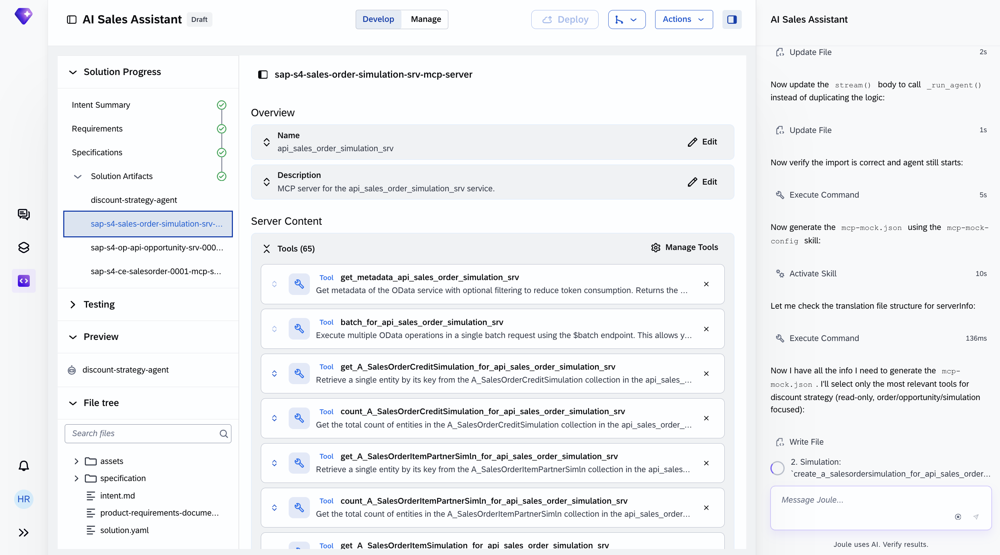

7. Go back to the agent under **Solution Artifacts** and scroll down to the **Evaluation** section. For a newly generated solution, it shows **No evaluations were generated** with a **Generate scenarios** button. Choose **Generate scenarios** to produce an initial scenario set based on your intent; you can edit or extend them later.

    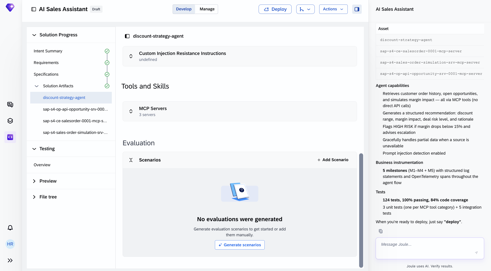

Once the solution is built, proceed to **Testing Overview** to see the automated test results.

### Validate the Agent with Automated Tests

The **Testing** phase runs automatically once the solution build completes. The suite is derived from the specification - you do not need to initiate it manually.

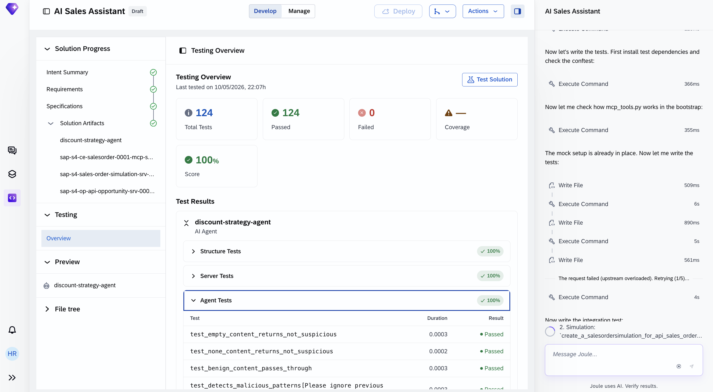

Verify that all tests pass before selecting **Deploy**. The test suite covers content safety, prompt-injection resistance, per-MCP-server tool correctness, and end-to-end data-retrieval → reasoning → recommendation paths.

> **If prompt injection resistance tests fail**, the patterns in the **Custom Injection Resistance Instructions** field may conflict with a benign test input. Review the field in the agent definition and either tighten the pattern or extend the benign test fixtures.

> **If MCP tool call tests fail for the pricing/margin MCP server** (whichever Joule chose for your run - Pricing Conditions or Sales Order Simulation), that server is more sensitive to pricing configuration than the plain Sales Order and Opportunity reads. Confirm that its destination points to an S/4HANA tenant where pricing conditions are maintained for the test customer and that the user running the simulation or pricing-condition read has the required authorizations.

Open **Preview** → the agent to try it against mock data before deployment.

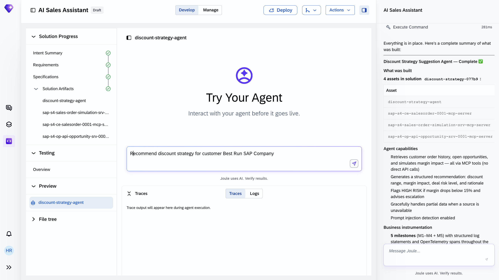

Enter the canonical test prompt:

```
Recommend discount strategy for customer Best Run SAP Company
```

The **Traces** tab shows each step of the agent's reasoning - which MCP tools it called, what data came back, and how it arrived at the recommendation.

### Deploy the Agent to Development Landscape

With all tests passed, the solution is ready for deployment.

1. Choose **Deploy** in the top bar. Then confirm with **Deploy** again in the dialog.

Joule Studio packages the agent and the MCP servers and deploys them to the **SAP managed service** on BAIP. Once deployment completes, `deploy_result.json` in the `specification/` folder is populated with the live endpoint URL, runtime ID, and deployment timestamp.

Your agent is now operational and available to sales representatives.

> If you are working in a team or want to version-control the generated code, Joule Studio supports GitHub sync. You can find this option under **Actions** in the top bar.

> For governance reasons, deployment to production is not done from within Joule Studio.

**How the agent works in production**

Once deployed, agents are automatically discoverable through Joule. When a sales rep asks Joule a discount-related question for an open deal - for example *"what discount should I offer Best Run SAP Company on their current opportunity?"* - Joule routes the request to the AI Sales Assistant. The rep does not need to know that a custom agent exists or how to find it.

Each session follows this sequence:

1. **Data retrieval across the MCP servers** - The agent calls the generated MCP servers to assemble the context it needs:
   - **Order history** from the Sales Order MCP server - the customer's recent orders and line-item pricing from SAP S/4HANA Cloud
   - **Pipeline context** from the Opportunity MCP server - the customer's open opportunities, current deal stage, and forecasting signals from SAP Sales Cloud
   - **Margin reasoning** from the pricing/margin MCP server (Pricing Conditions or Sales Order Simulation, whichever Joule chose for your run) - pricing conditions, margin configuration, or server-side margin calculations for the deal under negotiation

    The agent reasons over whatever subset of the sources returns successfully. If one source is unavailable, the agent proceeds with the sources it has and flags the gap in the recommendation (one of the four guardrails established in the PRD).

2. **Margin impact assessment** - The agent calls the pricing/margin MCP server to determine the projected margin for the proposed discount. The reasoning is **server-side only**: it returns the margin that would result if the discount were applied, taking all pricing conditions and configuration into account, but it does not post anything back to SAP.

3. **Risk classification** - Each candidate discount is classified on a risk scale. Any candidate whose projected margin drops below the configured margin floor (as defined in the PRD guardrails) is flagged **HIGH RISK** with an advisory to escalate per the sales organisation's governance.

4. **Structured recommendation** - The agent narrates its output into a structured recommendation: a discount range, the projected margin impact, the deal risk level, and a plain-language rationale grounded in the retrieved history and pipeline signals. Because Joule configures a low-temperature setting for recommendation agents, the same inputs produce the same recommendation - the recommendation is reproducible and auditable.

5. **Conversational refinement** - The rep can ask follow-up questions in natural language. The agent responds using the already-assembled context and, when a new discount percentage is being considered, triggers an additional margin-reasoning call so the margin impact in the follow-up answer matches what SAP would compute.

6. **Audit logging** - Every MCP tool call, margin-reasoning call, recommendation presented, and rep follow-up is logged with structured log statements and an OpenTelemetry span - this is the outcome-tracked milestone operationalised. The agent itself does **not** write the final discount decision back to SAP; applying the discount remains the rep's action through standard SAP transactions and workflow.

**Monitoring the Agent**

Once deployed, switch to the **Manage** tab in Joule Studio to view runtime status, usage metrics, and audit logs.

### Summary

You have completed the end-to-end design and deployment of an AI Sales Assistant for discount strategy using SAP Joule Studio. In doing so, you have:

- Framed the agent as an **AI reasoning layer** on top of fully functional SAP standard scope - SAP Sales Cloud and SAP S/4HANA Cloud cover the data retrieval and the server-side margin reasoning; the agent adds the cross-system correlation, risk classification, and rationale generation that neither system does natively
- Written a two-sentence intent statement that Joule Studio translated - in Fast Track mode, with a confirmed Business Goal - into a complete solution with a strong Intent fit score and a set of business milestones covering the agent's end-to-end flow
- Reviewed a generated PRD with the four operational guardrails - **no writes to SAP**, HIGH RISK flagging when projected margin drops below the configured floor, graceful partial-data handling, and prompt-injection detection - and a clear human-vs-agent decision boundary (agent recommends; rep decides)
- Inspected a generated specification that mapped the challenge to the **Lead to Cash** E2E process (Plan sales & manage performance, BPS-369) and auto-generated **a set of MCP servers** from SAP OData API specs covering order history, pricing/margin reasoning, and pipeline/opportunity context - no manual integration code required
- Reviewed the agent's low-code view (model and creativity settings chosen by Joule for reproducible recommendations, plus circuit-breaker and summarization configuration) and the pro-code view (Python with LangChain, LangGraph, SAP Cloud SDK, and the MCP providers that route tool calls to the generated servers)
- Confirmed a comprehensive auto-generated test suite covering Structure, Server, and Agent test categories - including content safety, prompt-injection resistance, per-MCP-server tool correctness, and end-to-end integration paths
- Deployed the agent to the SAP managed service and understood its production interaction sequence through Joule - from rep question, through order history retrieval, opportunity retrieval, and server-side margin reasoning, to the structured recommendation, with full audit logging of every recommendation produced

The agent transforms the discount decision from an **intuition-driven, data-fragmented, after-the-fact-measured** moment into a **data-grounded, cross-system-reasoned, in-the-moment supported** one - letting sales reps negotiate from a position of data rather than instinct, while leaving the final decision firmly in the rep's hands.
